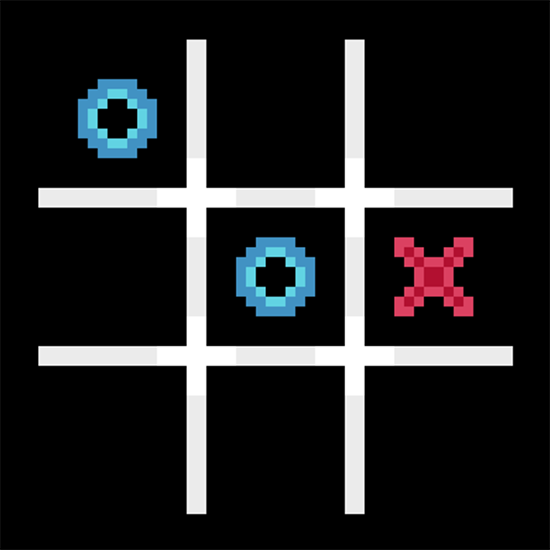

# TicTacToe

TicTacToe made in Godot engine with GDScript using Pixelart created using Aseprite

## What I Learned
* How to use a new Engine
  * Using Tilemaps to build the Scene
  * Accessing and manipulating Nodes and Scenes from Code
  * Importing and playing Sounds from Code
  * Working Node Signals
* Learning to use a High Level Language similiar to Python
* Creating Pixelart using Aseprite
